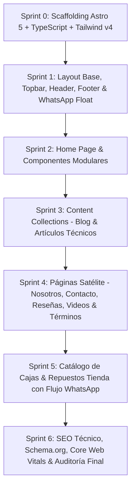

# 🗺️ Roadmap Técnico Maestro: Migración a Astro 5 + Tailwind CSS (UI Clara / Navy Blue)

> **Objetivo de la Transformación:** Convertir los archivos HTML estáticos originales (`index.html`, `sobre-nosotros.html`, `jsan-ecommerce.html`, `assets/`) a una aplicación web nativa en **Astro 5 + TypeScript + Tailwind CSS**, adoptando el **100% de la arquitectura, tipado, optimizaciones, contenido y fuente única de verdad (`site.ts`) de `hidromaticos-web`**, pero preservando de forma intacta e innegociable la **UI Clara Navy Blue (`#0f2a57`), acentos oro (`#c9a227`), tipografías (*Barlow* & *Barlow Condensed*), microinteracciones y componentes visuales específicos**.

---

## 🎨 Matriz de Identidad Visual & UI Tokens Invariables

La identidad visual clara de esta versión se define mediante un sistema de tokens CSS nativos y utilidades Tailwind:

```css
/* ============ DESIGN TOKENS (LIGHT / NAVY & GOLD) ============ */
:root {
  --navy: #0f2a57;         /* Azul marino institucional */
  --navy-deep: #0a1e40;    /* Fondo marino profundo (Topbar, Footers, Bloque proceso) */
  --navy-panel: #16346b;   /* Superficie de tarjetas en fondos oscuros */
  --blue: #2159c3;         /* Azul de acción y enlaces primarios */
  --blue-hover: #1a48a3;   /* Estado hover interactivo */
  --sky: #eef4fb;          /* Superficie clara secundaria y cards */
  --sky-line: #d7e3f4;     /* Bordes y líneas divisorias claras */
  --white: #ffffff;        /* Fondo base y tarjetas */
  --muted: #55607a;        /* Texto secundario sobre fondo claro */
  --muted-dark: #a8b6d4;   /* Texto secundario sobre fondo oscuro */
  --gold: #c9a227;         /* Dorado del escudo, acentos y estrellas */
  --gold-soft: #e9c25c;    /* Dorado claro para hovers y sub-badges */
  --green: #178a42;        /* WhatsApp y badges de disponibilidad */
  --radius: 16px;
  --font-display: 'Barlow Condensed', sans-serif;
  --font-body: 'Barlow', sans-serif;
}
```

---

## 🏗️ Matriz de Mapeo de Contenidos: `hidromaticos-web` ➔ `webjsanv2` (UI Clara)

| Sección / Dominio de Datos | Origen en `hidromaticos-web` | Destino en `webjsanv2` (Astro 5) | Adaptación a UI Clara |
| :--- | :--- | :--- | :--- |
| **Fuente de Verdad (SITE)** | `src/data/site.ts` | `src/data/site.ts` | Conserva teléfonos fijos, WhatsApp 0424, RIF `J-40348320-5`, sede Monte Cristo y enlaces oficiales. |
| **Hero Principal** | `src/pages/index.astro` (dark) | `src/components/Hero.astro` + `src/pages/index.astro` | Titular en Barlow Condensed con halo celeste/blanco, escudo oficial `logo-jsan.webp` y badge flotante `float-card` con check azul. |
| **Franja Confianza** | `stats` en `index.astro` | `src/components/TrustStrip.astro` | Banner horizontal Navy Blue con estrellas doradas (`★`) y métricas del taller. |
| **Servicios** | `SERVICIOS` (4 categorías) | `src/components/ServicesList.astro` + `src/components/ServicesGrid.astro` | Lista editorial numerada (`01`, `02`, `03`, `04`) con hover dinámico a fondo `--sky` y vista por categorías de recuadros blancos. |
| **Proceso de Trabajo** | `PROCESO` (4 pasos) | `src/components/ProcessCards.astro` | Contenedor oscuro (`--navy-panel`) con numeración en oro suave (`--gold-soft`). |
| **Marcas Compatibles** | `MARCAS` (16 marcas SVG) | `src/components/BrandsMarquee.astro` | Marquesina fluida con logos SVG embebidos y tipografía Barlow Condensed. |
| **Marcas USA Repuestos** | `src/components/MarcasUsa.astro` | `src/components/MarcasUsa.astro` | Tarjetas de Sonnax, TransGo, Transtec y Precision Intl con logos PNG y enlaces oficiales. |
| **Catálogo de Repuestos / Cajas** | *No presente en hidromaticos* | `src/pages/tienda.astro` + `src/components/PartsCatalog.astro` | Catálogo filtrable por tipo de caja y estado, adaptado de `jsan-ecommerce.html` con botón de cotización por WhatsApp. |
| **Testimonios / Reseñas** | `RESENAS` (Google Maps ★4.6) | `src/components/ReviewsSection.astro` + `src/components/ReviewCarousel.astro` | Citas con avatar iniciales doradas y carrusel continuo. |
| **Sede y Ubicación** | Datos de Monte Cristo | `src/components/LocationCard.astro` | Tarjeta con datos completos, horario, badge `SEDE CENTRAL` y link directo a Google Maps. |
| **Preguntas Frecuentes** | JSON-LD FAQ en `index.astro` | `src/components/FaqAccordion.astro` | Acordeón nativo `<details>` accesible con cruz animada `+`. |
| **Nosotros** | `src/pages/nosotros.astro` | `src/pages/nosotros.astro` | Propósito, Misión, Visión (PMV) con numeración sticky y 5 valores en píldoras doradas. |
| **Contacto** | `src/pages/contacto.astro` | `src/pages/contacto.astro` | 4 canales de contacto (WhatsApp, Teléfonos fijos, Email, Horario) y mapa de ubicación. |
| **Reseñas** | `src/pages/resenas.astro` | `src/pages/resenas.astro` | Muro completo de opiniones reales de Google Maps y CTA para calificar. |
| **Videos / Multimedia** | `src/pages/videos.astro` | `src/pages/videos.astro` | Video destacado de YouTube (`cabwaOuhG-U`) + 7 Reels verticales de Instagram. |
| **Blog Técnico** | `src/content/blog/*.md` (3 artículos) | `src/pages/blog/index.astro` + `src/pages/blog/[...slug].astro` | Content Collections con tipado estricto Zod y lectura optimizada. |
| **Legal** | `src/pages/terminos.astro` | `src/pages/terminos.astro` | 12 cláusulas de términos y condiciones de servicio y garantía de transmisiones. |

---

## 🚀 Fases & Sprints de Ejecución Detallada



---

### 📦 Sprint 0: Scaffolding, Tipos & Setup de Arquitectura
**Meta:** Configurar el entorno de Astro 5, TypeScript en modo estricto, Tailwind CSS y las fuentes autohospedadas.

#### 1. Archivos a configurar:
- [ ] `package.json`:
  - `astro`: `^5.x`
  - `@astrojs/sitemap`: `^3.x`
  - `@astrojs/tailwind` o `@tailwindcss/vite`
  - `@fontsource/barlow`: `^5.x` (pesos 400, 500, 600, 700)
  - `@fontsource/barlow-condensed`: `^5.x` (pesos 500, 600, 700)
  - `typescript`: `^5.x`
- [ ] `astro.config.mjs`:
  - `site`: `'https://webjsanv2.vercel.app'` (o dominio final)
  - Integraciones: `sitemap()`, `tailwind()`
- [ ] `tsconfig.json`:
  - `extends: "astro/tsconfigs/strict"`
  - `baseUrl: "."`, `paths: { "@/*": ["src/*"] }`
- [ ] `src/styles/global.css`:
  - Import de fuentes `@fontsource`.
  - Definición completa de tokens CSS variables (`--navy`, `--gold`, `--sky`, `--blue`, etc.).
  - Estilos de reset y utilidades base.
- [ ] `public/`:
  - Mover assets estáticos de `assets/` a `public/assets/` (`logo-jsan.webp`, `favicon.png`, `og-jsan.jpg`, marcas USA y fotos de productos).
  - Añadir `robots.txt` y `llms.txt`.

---

### 🏛️ Sprint 1: Fundaciones UI & Layout Base
**Meta:** Construir el `BaseLayout` y los componentes estructurales globales con el diseño exacto.

#### 1. `src/data/site.ts` (Fuente Única de Verdad):
- [ ] Portar objeto `SITE` (nombre, RIF `J-40348320-5`, teléfonos `0212-235.1931` / `0212-237.7340`, WhatsApp `0424-232.0424`, correo, dirección Monte Cristo).
- [ ] Portar `NAV` con rutas actualizadas (`/`, `/tienda`, `/#repuestos`, `/#sedes`, `/nosotros`, `/contacto`, `/blog`, `/videos`, `/resenas`).
- [ ] Portar `SOCIAL`, `RESENAS`, `MARCAS` (16 marcas automotrices) y helper `waLink(mensaje)`.

#### 2. Componentes Globales:
- [ ] **`src/layouts/BaseLayout.astro`**:
  - Parámetros: `title`, `description`, `path`, `jsonLdExtra`, `ogImage`.
  - Inyección de GeoTags (Caracas / Miranda: `10.4965, -66.8378`), Canónicos, Open Graph 1200x630, Twitter Cards y Schema.org `AutoRepair`.
- [ ] **`src/components/Topbar.astro`**:
  - Barra superior en fondo `--navy-deep` con borde inferior `--gold`.
  - Enlaces clickeables `tel:` y texto de sede.
- [ ] **`src/components/Header.astro`**:
  - Barra sticky con efecto `backdrop-filter: blur(8px)` y fondo semitransparente.
  - Escudo corporativo, navegación desktop con hover azul, botón móvil `menu-toggle` y CTA principal WhatsApp.
- [ ] **`src/components/MobileMenu.astro`**:
  - Panel deslizante lateral (drawer) con enlaces `m-link` y botón de cierre circular.
- [ ] **`src/components/SiteFooter.astro`**:
  - Pie institucional en `--navy-deep` con grid de 4 columnas (Logo + Datos de contacto + Enlaces rápidos + Horario/Sede) y franja de copyright/RIF.
- [ ] **`src/components/WhatsAppFloat.astro`**:
  - Botón flotante animado con pulso y enlace directo a chat de WhatsApp.

---

### ⚡ Sprint 2: Home Page Modular & Secciones de Alto Impacto
**Meta:** Portar la página principal (`src/pages/index.astro`) integrando el contenido de hidromaticos-web en la UI Navy.

#### Componentes de la Home:
- [ ] **`src/components/Hero.astro`**:
  - Eyebrow pill: `★ Caracas · Miranda · Desde 2013`.
  - Titular: *Tu caja automática en manos de Líderes* (con `.hl` en azul).
  - Escudo en stage radial con sombra suave y tarjeta flotante `float-card` (Diagnóstico con scanner).
  - Botones CTA (`btn-primary` para WhatsApp y `btn-ghost` para Servicios).
- [ ] **`src/components/TrustStrip.astro`**:
  - Franja horizontal Navy con borde dorado superior y 4 propuestas de valor con estrella dorada `★`.
- [ ] **`src/components/ServicesList.astro` & `src/components/ServicesGrid.astro`**:
  - Lista interactiva numerada (`01`, `02`, `03`, `04`) con hover expandido.
  - Grid de categorías con sub-items detallados (Diagnóstico, Overhaul, ATF, Repuestos).
- [ ] **`src/components/ProcessCards.astro`**:
  - Grid de 4 columnas en fondo degradado oscuro (`--navy` a `--navy-deep`) con bordes sutiles: *1. Traes el carro → 2. Escaneamos → 3. Apruebas → 4. Entregamos*.
- [ ] **`src/components/BrandsMarquee.astro`**:
  - Marquesina continua infinita con los 16 SVGs de marcas automotrices (Toyota, Ford, Chevrolet, etc.).
- [ ] **`src/components/MarcasUsa.astro`**:
  - Sección de repuestos importados de Estados Unidos con logos de Sonnax, TransGo, Transtec y Precision International.
- [ ] **`src/components/ReviewsSection.astro` & `src/components/ReviewCarousel.astro`**:
  - Bloque con cita destacada e iniciales doradas en avatar circular.
  - Carrusel horizontal con reseñas reales de Google Maps.
- [ ] **`src/components/LocationCard.astro`**:
  - Tarjeta de la sede Monte Cristo con botón de llamada directa y Google Maps.
- [ ] **`src/components/FaqAccordion.astro`**:
  - Acordeón nativo con tags `<details>` y `<summary>` estilizados con cruz `+` en oro.
- [ ] **`src/components/FinalCta.astro`**:
  - Bloque final de conversión con fondo Navy y acento dorado superior.

---

### 📝 Sprint 3: Content Layer & Blog Técnico
**Meta:** Implementar Astro 5 Content Layer con tipado Zod y migrar los artículos técnicos.

#### 1. Esquema y Colección:
- [ ] **`src/content.config.ts`**:
  ```typescript
  import { defineCollection, z } from 'astro:content';
  import { glob } from 'astro/loaders';

  const blog = defineCollection({
    loader: glob({ pattern: '**/*.md', base: './src/content/blog' }),
    schema: z.object({
      title: z.string(),
      description: z.string(),
      pubDate: z.coerce.date(),
      kicker: z.string(),
      readingTime: z.number().default(4),
      author: z.string().default('Hidromáticos J-SAN'),
    }),
  });
  export const collections = { blog };
  ```

#### 2. Artículos Markdown a migrar:
- [ ] `src/content/blog/por-que-patina-mi-caja-automatica.md`
- [ ] `src/content/blog/que-es-el-servicio-atf.md`
- [ ] `src/content/blog/senales-del-convertidor-de-par.md`

#### 3. Páginas del Blog:
- [ ] **`src/pages/blog/index.astro`**: Grid de guías mecánicas en tarjetas claras con kickers en azul y fechas formateadas.
- [ ] **`src/pages/blog/[...slug].astro`**: Plantilla de lectura individual con renderizado de Markdown, breadcrumbs, schema `BlogPosting` y CTA de diagnóstico por WhatsApp.

---

### 🧭 Sprint 4: Páginas Satélite & Red de Contenido
**Meta:** Desarrollar las páginas interiores dedicadas manteniendo consistencia estética.

- [ ] **`src/pages/nosotros.astro`**:
  - Bloques de Propósito, Misión y Visión (PMV) con numeración sticky `N° 01`, `N° 02`, `N° 03`.
  - Frases destacadas con borde izquierdo dorado `--gold`.
  - Grid de 5 valores fundamentales (Atención, Asesoría, Seriedad, Puntualidad, Calidad) con estrellas doradas.
- [ ] **`src/pages/contacto.astro`**:
  - Grid de 4 canales de atención: WhatsApp Directo, Teléfonos Fijos (0212), Correo Institucional y Horario de Atención.
  - Bloque de ubicación de Monte Cristo con CTA directo a Google Maps.
- [ ] **`src/pages/resenas.astro`**:
  - Indicador de calificación global: **★ 4.6 con 35 opiniones en Google Maps**.
  - Carrusel y muro de opiniones completas.
  - Botón "Dejar mi reseña" enlazado al perfil oficial de Google Business Profile.
- [ ] **`src/pages/videos.astro`**:
  - Video destacado de YouTube embebido con reproductor accesible.
  - Grid de 7 Reels verticales de Instagram sobre trabajos en taller.
  - Marcado estructurado `VideoObject` para Google Search.
- [ ] **`src/pages/terminos.astro`**:
  - Documento legal completo de 12 cláusulas: servicios, presupuestos, diagnóstico, repuestos, garantías de 3 a 6 meses, pagos y responsabilidades.

---

### 🛒 Sprint 5: Catálogo de Cajas & Repuestos (Tienda UI con Conversión WhatsApp)
**Meta:** Portar la interfaz de catálogo de `jsan-ecommerce.html` convirtiéndola en un componente Astro interactivo y optimizado.

- [ ] **`src/data/productos.ts`**:
  - Tipado de productos (ID, nombre, marca, tipo, estado: *Usada / Recondicionada / Nueva*, precio referencial, stock, imagen, especificaciones técnicas).
  - Catálogo de transmisiones destacadas (Toyota Corolla/Yaris, Ford Explorer/F-150, Chevrolet Aveo/Cruze, Hyundai Tucson, BMW ZF, etc.).
- [ ] **`src/components/ProductCard.astro`**:
  - Tarjeta de producto con badge de estado en color semántico (`be-usada` en oro, `be-recon` en azul, `be-nueva` en verde).
  - Lista de especificaciones técnicas con viñetas doradas.
  - Botón interactivo "Consultar por WhatsApp" con mensaje pre-rellenado del producto exacto.
- [ ] **`src/pages/tienda.astro`**:
  - Barra de filtros superiores por marca y estado.
  - Grid responsivo de productos.
  - Bloque explicativo "Cómo comprar tu transmisión en 4 pasos".
  - Garantías asociadas por categoría de repuesto.

---

### 🎯 Sprint 6: Optimización SEO, Performance, Schema.org & QA
**Meta:** Asegurar 100/100 en Core Web Vitals, accesibilidad WCAG AA y verificación de compilación.

- [ ] **SEO & Metadatos**:
  - Marcados JSON-LD completos: `AutoRepair`, `FAQPage`, `BlogPosting`, `VideoObject`, `Product`, `AggregateRating`.
  - Configuración de Open Graph 1200x630 para cada página.
- [ ] **Performance & Web Vitals**:
  - Optimización de imágenes a formato WebP moderno.
  - Eliminación de scripts bloqueantes del renderizado.
  - Validación de First Contentful Paint (FCP) < 0.8s e Interaction to Next Paint (INP) < 50ms.
- [ ] **Accesibilidad (a11y)**:
  - Contrastes WCAG AA verificados sobre fondos Navy y White.
  - Soporte de teclado completo (`:focus-visible` con anillo dorado).
  - Atributos `aria-expanded`, `aria-label` y roles semánticos.
- [ ] **Build & Deploy QA**:
  - Compilación sin errores con `npm run build`.
  - Validación de rutas estáticas generadas en `dist/`.
  - Despliegue y verificación en Vercel.

---

## 📋 Checklist de Verificación por Sprint

```markdown
- [ ] Sprint 0: Configuración de Astro 5, Tailwind v4, tipografías Barlow y estructura base de carpetas.
- [ ] Sprint 1: BaseLayout, fuente de verdad site.ts, Topbar, Header, Footer y botón flotante de WhatsApp.
- [ ] Sprint 2: Home page completa (Hero con badge, TrustStrip, Servicios editorial, Proceso 4 pasos, Marcas, FAQ).
- [ ] Sprint 3: Colección de contenidos Blog con Zod, 3 guías técnicas y páginas /blog y /blog/[slug].
- [ ] Sprint 4: Páginas satélite /nosotros, /contacto, /resenas, /videos y /terminos.
- [ ] Sprint 5: Catálogo de repuestos y transmisiones en /tienda con consulta por WhatsApp.
- [ ] Sprint 6: JSON-LD Schemas, Sitemap XML, Robots, Core Web Vitals 100/100 y QA en Vercel.
```
