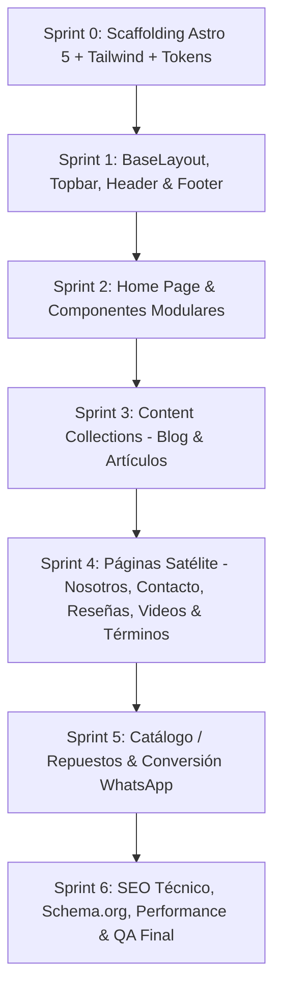

# 🗺️ Roadmap Técnico: Migración a Astro 5 + Tailwind CSS (UI Clara / Navy Blue)

> **Objetivo:** Convertir el sitio estático original (`index.html`, `sobre-nosotros.html`, `jsan-ecommerce.html`) a una arquitectura moderna, escalable y ultra-optimizada en **Astro 5 + TypeScript + Tailwind CSS**, adoptando el **100% del contenido real y estructura de datos de `hidromaticos-web`**, pero preservando de manera intacta la **identidad visual clara, paleta Navy Blue (`#0f2a57`), tipografías (Barlow & Barlow Condensed), microinteracciones y tokens de diseño**.

---

## 🎨 Principios de Diseño & UI Invariants

1. **Paleta Institucional Navy / Oro / Azul:**
   - `--navy`: `#0f2a57` (azul marino institucional).
   - `--navy-deep`: `#0a1e40` (fondo marino profundo).
   - `--navy-panel`: `#16346b` (tarjetas y módulos en fondo oscuro).
   - `--blue`: `#2159c3` / `--blue-hover`: `#1a48a3` (botones principales de acción).
   - `--gold`: `#c9a227` / `--gold-soft`: `#e9c25c` (acentos dorados, bordes y estrellas).
   - `--sky`: `#eef4fb` / `--sky-line`: `#d7e3f4` (fondos claros secundarios y divisores).
   - `--white`: `#ffffff`.
   - `--muted`: `#55607a` / `--muted-dark`: `#a8b6d4`.

2. **Tipografía:**
   - **Display / Titulares:** `Barlow Condensed` (500, 600, 700).
   - **Body / Textos:** `Barlow` (400, 500, 600, 700).

3. **Arquitectura de Componentes Astro:**
   - Componentes modulares, sin frameworks JS pesados (0 KB JS por defecto en cliente).
   - Tipado estricto con TypeScript.
   - Fuente única de verdad (`src/data/site.ts`) para teléfonos, RIF, sedes, reseñas y navegación.

---

## 🚀 Fases & Sprints de Ejecución

---

### 📦 Sprint 0: Scaffolding & Setup de Arquitectura
**Meta:** Configurar el entorno Astro 5 limpio, TypeScript y Tailwind CSS con la paleta de tokens Navy Blue.

- [ ] Inicializar `package.json` con Astro 5.x, `@astrojs/sitemap`, `@astrojs/tailwind` o Tailwind v4.
- [ ] Configurar `astro.config.mjs` con `site: 'https://webjsanv2.vercel.app'` (o dominio asignado).
- [ ] Configurar `tsconfig.json` con modo estricto.
- [ ] Definir tokens CSS globales y tipografías Google Fonts en `src/styles/global.css`.
- [ ] Organizar `public/assets/` con logotipos originales (`logo-jsan.webp`, `logo-jsan.png`), favicons, marcas de vehículos y open graph image.

---

### 🏛️ Sprint 1: Fundaciones UI & Layout Base
**Meta:** Construir el `BaseLayout` y los componentes estructurales globales con el diseño exacto.

- [ ] **`src/data/site.ts`**: Portar la fuente única de verdad con datos oficiales (teléfonos, WhatsApp, RIF `J-40348320-5`, dirección Monte Cristo, enlaces de redes y reseñas).
- [ ] **`src/layouts/BaseLayout.astro`**: Metadatos SEO, Open Graph, Twitter Cards, Schema `AutoRepair`, favicon y preconnects tipográficos.
- [ ] **`src/components/Topbar.astro`**: Barra superior azul oscuro (`--navy-deep`) con borde dorado (`--gold`), teléfonos con enlace `tel:` y horario.
- [ ] **`src/components/Header.astro`**: Barra de navegación sticky con blur de fondo, isotipo, enlaces principales y botón CTA `btn-primary`.
- [ ] **`src/components/SiteFooter.astro`**: Pie de página institucional azul marino con datos de contacto, enlaces legales y créditos.
- [ ] **`src/components/WhatsAppFloat.astro`**: Botón flotante de WhatsApp estilizado con trigger directo.

---

### ⚡ Sprint 2: Home Page Modular & Secciones de Alto Impacto
**Meta:** Portar la página principal (`src/pages/index.astro`) integrando el contenido de hidromaticos-web en la UI Navy.

- [ ] **Hero Section (`src/components/Hero.astro`)**:
  - Título display en Barlow Condensed, badge 'Especialistas en Cajas Automáticas'.
  - CTA dual (WhatsApp directo + Ver Servicios).
  - Escudo/Emblema central con badge flotante (`float-card`) de garantía y diagnóstico.
- [ ] **Franja de Confianza (`src/components/TrustStrip.astro`)**:
  - Banner horizontal con estrellas doradas (`★`) y propuestas de valor clave.
- [ ] **Servicios Editorial (`src/components/ServicesList.astro`)**:
  - Lista numerada (`01, 02, 03...`) con hover dinámico azul (`--sky`), descripción y flechas interactivas.
- [ ] **Proceso de Trabajo (`src/components/ProcessCards.astro`)**:
  - Bloque oscuro en grid (`--navy-panel`) con los 4 pasos (Recepción & Escaneo → Presupuesto Transparente → Reparación con Repuestos Originales → Prueba de Ruta & Entrega).
- [ ] **Marcas Atendidas (`src/components/BrandsGrid.astro`)**:
  - Grid tipográfico y logotipos de marcas compatibles (Toyota, Ford, Chevrolet, Jeep, Hyundai, Nissan, etc.).
- [ ] **Marcas USA Repuestos (`src/components/MarcasUsa.astro`)**:
  - Sonnax, TransGo, Transtar, Precision International.
- [ ] **Testimonios / Reseñas (`src/components/ReviewsSection.astro`)**:
  - Cita destacada con tipografía editorial y carrusel/grid de reseñas de Google Maps.
- [ ] **Sedes / Ubicación (`src/components/LocationsSection.astro`)**:
  - Tarjeta de la sede Monte Cristo (Caracas / Miranda) con enlace a Google Maps y llamada directa.
- [ ] **FAQ Desplegable (`src/components/FaqAccordion.astro`)**:
  - Acordeón nativo `
` con animación de cruz dorada `+`.

---

### 📝 Sprint 3: Content Layer & Blog Técnico
**Meta:** Implementar Astro 5 Content Collections para los artículos educativos de mecánica.

- [ ] **`src/content.config.ts`**: Definir esquema Zod estricto para la colección `blog` (título, descripción, fecha, autor, imagen, tags).
- [ ] Portar artículos Markdown:
  - `por-que-patina-mi-caja-automatica.md`
  - `que-es-el-servicio-atf.md`
  - `senales-del-convertidor-de-par.md`
- [ ] **`src/pages/blog/index.astro`**: Listado de artículos con cards estilizadas en paleta Navy.
- [ ] **`src/pages/blog/[...slug].astro`**: Vista de lectura individual con tipografía optimizada, breadcrumb y CTA para agendar revisión.

---

### 🧭 Sprint 4: Páginas Satélite & Red de Contenido
**Meta:** Desarrollar las páginas interiores dedicadas manteniendo consistencia estética.

- [ ] **`src/pages/nosotros.astro`**: Historia del taller desde 2013, misión, fotos del equipo e infraestructura.
- [ ] **`src/pages/contacto.astro`**: Formas de contacto, mapa integrado, teléfonos fijos, WhatsApp y formulario directo.
- [ ] **`src/pages/resenas.astro`**: Muro completo de opiniones y calificaciones de clientes.
- [ ] **`src/pages/videos.astro`**: Galería de videos explicativos y casos de éxito en el taller.
- [ ] **`src/pages/terminos.astro`**: Términos de garantía, condiciones de servicio y políticas de entrega.

---

### 🛒 Sprint 5: Catálogo de Cajas & Repuestos (Adaptación Ecommerce UI)
**Meta:** Modularizar la sección de repuestos e importaciones presente en `jsan-ecommerce.html` adaptada a conversión por WhatsApp.

- [ ] **`src/components/PartsCatalog.astro`**: Grid de transmisiones, convertidores de par, kits de reconstrucción y cuerpos de válvulas.
- [ ] Filtro por tipo de transmisión (Automática convencional, CVT, DSG/Doble Embrague).
- [ ] Botón "Consultar Disponibilidad por WhatsApp" pre-rellenando el nombre del repuesto.

---

### 🎯 Sprint 6: Optimización SEO, Performance & QA
**Meta:** Asegurar puntuación 100/100 en Core Web Vitals y verificación completa.

- [ ] Generación automática de `sitemap-index.xml` y `robots.txt`.
- [ ] Marcado JSON-LD enriquecido (`AutoRepair`, `FAQPage`, `BreadcrumbList`).
- [ ] Optimización de imágenes (`<Image />` de Astro con WebP y lazy-loading).
- [ ] Auditoría de accesibilidad (a11y), contrastes WCAG AA y navegación por teclado.
- [ ] Build de producción y verificación de despliegue en Vercel.

---

## 📌 Resumen de Entregables

| Entregable | Descripción |
| :--- | :--- |
| **Framework** | Astro 5 (Zero JS client por defecto) |
| **Estilos** | CSS Variables nativas + Tailwind CSS |
| **Contenido** | 100% alineado a `hidromaticos-web` y datos reales |
| **Look & Feel** | UI Clara (Navy Blue `#0f2a57`, Gold `#c9a227`, Blanco) |
| **Rutas** | `/`, `/nosotros`, `/contacto`, `/resenas`, `/videos`, `/blog`, `/blog/[slug]`, `/terminos` |
