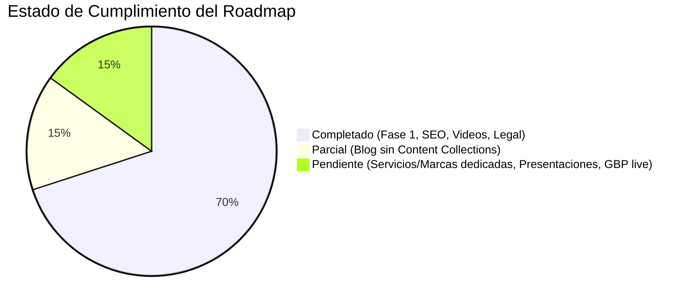

# 📋 Reporte de Code Review Integral — Hidromáticos J-SAN

> **Fecha:** 26 de agosto de 2026  
> **Repositorio:** `aikapenelope/hidromaticos-web`  
> **Alcance:** Auditoría estática y arquitectónica del repositorio completo (Astro 5 + Tailwind CSS v4)  
> **Metodología:** Doble Eje (*Standards* & *Spec*) según el estándar Martin Fowler / Protocolo de Ingeniería Blindada.

---

## 1. Resumen Ejecutivo de Salud del Código

| Métrica | Estado | Detalle |
|---|---|---|
| **Compilación (`npm run build`)** | ✅ PASA | 10 páginas estáticas generadas limpiamente en ~1.6s |
| **Integridad de Tipos (TypeScript)** | ⚠️ REGULAR | No existe [tsconfig.json](file:///Users/angelpenalver/orca/workspaces/Jsan/aikapenelope-hidromaticos-web/tsconfig.json) en la raíz ni scripts de chequeo de tipos (`@astrojs/check`) |
| **Fuente Única de Verdad (`site.ts`)** | ⚠️ CON DETALLES | Regla documental violada: existen teléfonos, direcciones y links hardcodeados en páginas |
| **Accesibilidad & HTML Semántico** | 🟡 BUENO | IDs duplicados en botones móviles (`#burger`) y atributos de iframe obsoletos |
| **SEO & Schema.org Structured Data** | ✅ EXCELENTE | Cobertura rica con `AutoRepair`, `Product`, `VideoObject`, `BlogPosting`, `FAQPage` y geotags |
| **Performance & Assets** | ✅ EXCELENTE | Fuentes self-hosted con `@fontsource`, SVGs vectoriales inyectados raw para `currentColor`, cero peticiones externas bloqueantes |

---

## 2. Standards (Estándares & Code Smells)

Esta sección evalúa el cumplimiento de las normas documentadas del proyecto (`README.md`, convenciones de TypeScript y buenas prácticas de Astro) junto con el catálogo basal de *Code Smells* de Martin Fowler (*Refactoring*, Cap. 3).

### 2.1. Violaciones a Reglas Documentadas del Repositorio

#### 🔴 Regla: "Cambiar teléfonos/direcciones SOLO en `src/data/site.ts`"
* **Ubicación:** [src/pages/contacto.astro:L31](file:///Users/angelpenalver/orca/workspaces/Jsan/aikapenelope-hidromaticos-web/src/pages/contacto.astro#L31) y [src/pages/contacto.astro:L60-63](file:///Users/angelpenalver/orca/workspaces/Jsan/aikapenelope-hidromaticos-web/src/pages/contacto.astro#L60-L63)
* **Hallazgo:** Se hardcodean números y direcciones en lugar de consumir las constantes declaradas en `SITE`:
```astro
<!-- src/pages/contacto.astro L31 -->
<a class="grande" target="_blank" rel="noopener" href={WA_FALLA}>+58 424-232.0424 ↗</a>

<!-- src/pages/contacto.astro L60-63 -->
<strong style="color:var(--orange)">SEDE:</strong> Urb. Monte Cristo, 1ra con 3ra transversal, Calle 10 — frente a
Campi Ferretería, Miranda · Caracas.<br /><br />
{SITE.horario}.
```
* **Solución:** Reemplazar por `{SITE.whatsappDisplay}` y `{SITE.sede}`.

#### 🔴 Inconsistencia de Dominio en Redes Sociales
* **Ubicación:** [src/data/site.ts:L23](file:///Users/angelpenalver/orca/workspaces/Jsan/aikapenelope-hidromaticos-web/src/data/site.ts#L23) vs [src/data/site.ts:L65](file:///Users/angelpenalver/orca/workspaces/Jsan/aikapenelope-hidromaticos-web/src/data/site.ts#L65)
* **Hallazgo:** En `SITE.redes.threads` se usa `https://www.threads.net/@hidromaticosjs` mientras que en el array `SOCIAL` se definió `https://www.threads.com/@hidromaticosjs` (`.com` en lugar de `.net`).

#### 🔴 Ficha `public/llms.txt` desactualizada
* **Ubicación:** [public/llms.txt:L13-36](file:///Users/angelpenalver/orca/workspaces/Jsan/aikapenelope-hidromaticos-web/public/llms.txt#L13-L36)
* **Hallazgo:** Omite la cuenta de Instagram en la línea 13 y no lista las rutas `/videos/`, `/blog/` ni `/terminos/` en la sección de páginas del sitio.

---

### 2.2. Configuración de Entorno & Tipado Estricto

#### ⚠️ Ausencia de `tsconfig.json` y `@astrojs/check`
* **Ubicación:** Raíz del proyecto / [package.json](file:///Users/angelpenalver/orca/workspaces/Jsan/aikapenelope-hidromaticos-web/package.json)
* **Hallazgo:** El proyecto no incluye un archivo `tsconfig.json`. Astro asume configuraciones por defecto permisivas, y no existe un script `"check": "astro check"` en `package.json` para validar tipos antes del build en CI/CD.
* **Solución:** Crear `tsconfig.json` extendiendo `astro/tsconfigs/strict` o `astro/tsconfigs/strictest`, e incorporar `@astrojs/check` y `typescript` como `devDependencies`.

#### 🟡 Importación Relativa Anómala
* **Ubicación:** [src/layouts/BaseLayout.astro:L2](file:///Users/angelpenalver/orca/workspaces/Jsan/aikapenelope-hidromaticos-web/src/layouts/BaseLayout.astro#L2)
* **Hallazgo:** 
```typescript
import '../../src/styles/global.css';
```
`BaseLayout.astro` está ubicado en `src/layouts/`, por lo que salir dos niveles hacia la raíz y volver a entrar a `src/` es redundante.
* **Solución:** Simplificar a `import '../styles/global.css';` o usar alias `import '~/styles/global.css';`.

---

### 2.3. Fowler Code Smells Baseline

#### 🟠 Duplicated Code (Código Duplicado)
1. **Carrusel de Reseñas:**
   * **Ubicación:** [src/pages/index.astro:L222-235](file:///Users/angelpenalver/orca/workspaces/Jsan/aikapenelope-hidromaticos-web/src/pages/index.astro#L222-L235) y [src/pages/resenas.astro:L44-57](file:///Users/angelpenalver/orca/workspaces/Jsan/aikapenelope-hidromaticos-web/src/pages/resenas.astro#L44-L57).
   * **Hunk:**
   ```astro
   {[0, 1].map(() =>
     RESENAS.map((r) => (
       <article class="car-card">
         <span class="t-stars">★★★★★</span>
         <p>{r.texto}</p>
         <div class="t-by">
           <span class="sqv">{r.iniciales}</span>
           <div><b>{r.nombre}</b><span>{r.meta}</span></div>
           <span class="t-src">{r.fuente}</span>
         </div>
       </article>
     ))
   )}
   ```
   * **Solución:** Extraer a un componente reutilizable `src/components/ReviewCarousel.astro`.

2. **Máscara SVG `world-dots`:**
   * **Ubicación:** Duplicada en [src/components/MarcasUsa.astro:L86-87](file:///Users/angelpenalver/orca/workspaces/Jsan/aikapenelope-hidromaticos-web/src/components/MarcasUsa.astro#L86-L87) y [src/pages/nosotros.astro:L20-21](file:///Users/angelpenalver/orca/workspaces/Jsan/aikapenelope-hidromaticos-web/src/pages/nosotros.astro#L20-L21).
   * **Solución:** Unificar la clase `.world-dots` con su máscara directamente en [src/styles/global.css](file:///Users/angelpenalver/orca/workspaces/Jsan/aikapenelope-hidromaticos-web/src/styles/global.css).

3. **Bloque de Opinión / CTA Google:**
   * **Ubicación:** Repetido casi idéntico en `index.astro`, `resenas.astro`, `videos.astro` y las páginas individuales de blog.

#### 🟠 Shotgun Surgery (Cirugía de Perdigón)
* Si las coordenadas geográficas del taller, la URL canónica de búsqueda en Google Maps o el texto de saludo estándar de WhatsApp cambian, es necesario editar:
  - `src/data/site.ts`
  - `src/layouts/BaseLayout.astro` (schema JSON-LD y geotags meta)
  - `src/pages/contacto.astro`
  - `src/pages/resenas.astro`
* **Solución:** Centralizar `SITE.geo = { lat: 10.4965, lng: -66.8378 }` y `SITE.mapsUrl` en `src/data/site.ts` y exportarlos directamente.

#### 🟡 Speculative Generality / Dead Code
* **Ubicación:** [src/pages/videos.astro:L94, L102](file:///Users/angelpenalver/orca/workspaces/Jsan/aikapenelope-hidromaticos-web/src/pages/videos.astro#L94)
* **Hunk:**
```astro
title={v.tipo === 'instagram' ? 'Reel de Instagram — Hidromáticos J-SAN' : 'Reel de Facebook — Hidromáticos J-SAN'}
<i>{v.tipo === 'instagram' ? 'INSTAGRAM · REEL' : 'FACEBOOK · REEL'}</i>
```
* **Hallazgo:** El array `VERTICALES` contiene únicamente elementos `tipo: 'instagram'` porque los embeds de Facebook son bloqueados por política de Meta. El condicional ternario es código muerto/especulativo.

#### 🟡 Reglas CSS Huérfanas / Redundantes
* **Ubicación:** [src/styles/global.css:L387](file:///Users/angelpenalver/orca/workspaces/Jsan/aikapenelope-hidromaticos-web/src/styles/global.css#L387)
* **Hunk:**
```css
@media (max-width:900px){
  ...
  .sb-nav a{display:none}
}
```
* **Hallazgo:** La clase `.sidebar` ya está oculta globalmente a `<=1020px` ([src/styles/global.css:L323](file:///Users/angelpenalver/orca/workspaces/Jsan/aikapenelope-hidromaticos-web/src/styles/global.css#L323)), haciendo innecesario ocultar los hijos `.sb-nav a` en `@media (max-width:900px)`.

---

### 2.4. HTML Semántico & Accesibilidad (A11y)

#### 🟡 Identificadores DOM Duplicados (`id="burger"`)
* **Ubicación:** [src/components/Topbar.astro:L31](file:///Users/angelpenalver/orca/workspaces/Jsan/aikapenelope-hidromaticos-web/src/components/Topbar.astro#L31) y [src/pages/index.astro:L107](file:///Users/angelpenalver/orca/workspaces/Jsan/aikapenelope-hidromaticos-web/src/pages/index.astro#L107).
* **Hallazgo:** `BaseLayout.astro` ejecuta:
```javascript
document.getElementById('burger')?.addEventListener('click', () => mnav.classList.add('open'));
```
`getElementById` solo engancha el primer elemento encontrado. Al usar clases como `.js-burger-toggle` o `document.querySelectorAll('[data-toggle-mnav]')`, se garantiza que cualquier botón hamburguesa (sea el del hero o el del topbar) abra el menú de forma fiable.

#### 🟡 Atributos de Iframe Obsoletos
* **Ubicación:** [src/pages/videos.astro:L97-98](file:///Users/angelpenalver/orca/workspaces/Jsan/aikapenelope-hidromaticos-web/src/pages/videos.astro#L97-L98)
* **Hallazgo:** `frameborder="0"` y `scrolling="no"` son atributos obsoletos en HTML5. El estilo `border: 0;` ya está cubierto por CSS en `.vs-frame iframe`.

---

## 3. Spec (Especificación & Roadmap)

Esta sección audita el grado de cumplimiento funcional del repositorio con respecto a los requisitos descritos en el [README.md](file:///Users/angelpenalver/orca/workspaces/Jsan/aikapenelope-hidromaticos-web/README.md) y las especificaciones del cliente.

### 3.1. Estado de Fases del Roadmap



| Fase | Requisito en Spec / README | Estado Actual | Observaciones |
|---|---|---|---|
| **Fase 1** | Port Astro del diseño industrial v2 (home, nosotros, reseñas, contacto) | ✅ **100% Completo** | Fiel a la maqueta industrial negro/naranja, responsivo y optimizado. |
| **Fase 2** | Páginas `/servicios/` y `/marcas/` + `FAQPage` schema | 🟡 **Parcial (50%)** | `FAQPage` schema está implementado en `index.astro`, pero `/servicios/` y `/marcas/` siguen como anclas internas `/#servicios` y `/#marcas`. |
| **Fase 3** | `/blog/` (Content Collections), `/videos/` y `/presentaciones/` | 🟡 **Parcial (65%)** | `/videos/` está completo con embeds reales. `/blog/` tiene 3 artículos estáticos `.astro`, pero **no utiliza Astro Content Collections** (`src/content/blog/*.md`). Falta `/presentaciones/`. |
| **Fase 4** | PlaceID Google Business → botón writereview + reseñas vía Places API | ⏳ **En espera de GBP** | Correctamente tipado y documentado con comentarios `TODO(placeid)`. Utiliza dataset real de 35 reseñas curadas. |
| **Fase 5** | Dominio en Vercel + Cloudflare DNS | ⏳ **Infraestructura** | Pendiente de delegación DNS del cliente. |

---

### 3.2. Auditoría de Requisitos SEO & Datos Estructurados

| Schema / Tag | Implementación | Evaluación |
|---|---|---|
| **AutoRepair (JSON-LD)** | [src/layouts/BaseLayout.astro:L26-61](file:///Users/angelpenalver/orca/workspaces/Jsan/aikapenelope-hidromaticos-web/src/layouts/BaseLayout.astro#L26-L61) | ✅ Impecable: RIF, geo-coordenadas, horarios, dirección física y enlaces `sameAs`. |
| **Geotags (Meta Tags)** | [src/layouts/BaseLayout.astro:L80-84](file:///Users/angelpenalver/orca/workspaces/Jsan/aikapenelope-hidromaticos-web/src/layouts/BaseLayout.astro#L80-L84) | ✅ Correcto: `geo.region`, `geo.placename`, `geo.position` e `ICBM` para Caracas/Miranda. |
| **OpenGraph & Twitter Cards** | [src/layouts/BaseLayout.astro:L86-99](file:///Users/angelpenalver/orca/workspaces/Jsan/aikapenelope-hidromaticos-web/src/layouts/BaseLayout.astro#L86-L99) | ✅ Completo con imagen 1200x630 real en `/assets/og-j-san.jpg`. |
| **FAQPage (JSON-LD)** | [src/pages/index.astro:L74-87](file:///Users/angelpenalver/orca/workspaces/Jsan/aikapenelope-hidromaticos-web/src/pages/index.astro#L74-L87) | ✅ Generado dinámicamente desde el array `SERVICIOS`. |
| **Product / Reviews (JSON-LD)** | [src/pages/resenas.astro:L14-26](file:///Users/angelpenalver/orca/workspaces/Jsan/aikapenelope-hidromaticos-web/src/pages/resenas.astro#L14-L26) | ✅ Incluye `AggregateRating` (4.6★) y array de opiniones. |
| **VideoObject (JSON-LD)** | [src/pages/videos.astro:L31-39](file:///Users/angelpenalver/orca/workspaces/Jsan/aikapenelope-hidromaticos-web/src/pages/videos.astro#L31-L39) | ✅ Embebido con metadatos de YouTube nocookie. |
| **Blog & BlogPosting** | [src/pages/blog.astro:L42-54](file:///Users/angelpenalver/orca/workspaces/Jsan/aikapenelope-hidromaticos-web/src/pages/blog.astro#L42-L54) | ✅ Estructurado en listado y detalle de artículos. |
| **Sitemap & Robots.txt** | [astro.config.mjs](file:///Users/angelpenalver/orca/workspaces/Jsan/aikapenelope-hidromaticos-web/astro.config.mjs) y [public/robots.txt](file:///Users/angelpenalver/orca/workspaces/Jsan/aikapenelope-hidromaticos-web/public/robots.txt) | ✅ Sitemap automático con `@astrojs/sitemap` y `robots.txt` optimizado para crawlers de IA (GPTBot, ClaudeBot, PerplexityBot). |

---

### 3.3. Rendimiento y Accesibilidad de Recursos

1. **Fuentes Web:**
   * Utiliza `@fontsource/anton` y `@fontsource/space-grotesk` auto-hospedadas. Cero peticiones de bloqueo de render a Google Fonts.
2. **Imágenes y Logotipos:**
   * El escudo corporativo está optimizado en WebP (`/assets/logo-jsan.webp`) con dimensiones explícitas para evitar CLS (*Cumulative Layout Shift*).
   * 16 logos de marcas automotrices cargados como SVGs planos vía `import.meta.glob('.../*.svg', { query: '?raw' })`, permitiendo cambiar color vía `currentColor` en CSS sin solicitudes de red HTTP adicionales.
3. **Animaciones y Reduced Motion:**
   * La animación del escudo en el Hero (`float-shield` y `pulse-halo`) respeta la directiva `@media (prefers-reduced-motion: reduce)` tanto a nivel global en [src/styles/global.css:L28](file:///Users/angelpenalver/orca/workspaces/Jsan/aikapenelope-hidromaticos-web/src/styles/global.css#L28) como en L372.

---

## 4. Resumen por Ejes & Métricas Finales

| Eje | Hallazgos Totales | Problema Más Crítico |
|---|---|---|
| **Standards** | **7 hallazgos** (3 violaciones de reglas/fuente de verdad, 3 smells de duplicación/cirugía de perdigón, 1 falta de `tsconfig.json`) | **Violación de Fuente Única de Verdad**: Presencia de cadenas de contacto/dirección hardcodeadas fuera de `src/data/site.ts`, y error de dominio `.com` vs `.net` en Threads. |
| **Spec** | **2 desviaciones** (Blog sin Content Collections tipadas, páginas `/servicios/` y `/marcas/` pendientes de independizar de los anclas del Home) | **Falta de Migración de Blog a Content Collections**: Los artículos están creados como páginas `.astro` rígidas en vez de Markdown tipado con `defineCollection` y `zod`. |

---

## 5. Plan de Acción Recomendado (Checklist Priorizado)

- [ ] **P0 (Inmediato):** Corregir en [src/data/site.ts](file:///Users/angelpenalver/orca/workspaces/Jsan/aikapenelope-hidromaticos-web/src/data/site.ts) `threads.com` por `threads.net`.
- [ ] **P0 (Inmediato):** Reemplazar cadenas hardcodeadas en [src/pages/contacto.astro](file:///Users/angelpenalver/orca/workspaces/Jsan/aikapenelope-hidromaticos-web/src/pages/contacto.astro) por `SITE.whatsappDisplay` y `SITE.sede`.
- [ ] **P1 (Tipado & DX):** Agregar `tsconfig.json` a la raíz y añadir `@astrojs/check` y `typescript` a `devDependencies` en [package.json](file:///Users/angelpenalver/orca/workspaces/Jsan/aikapenelope-hidromaticos-web/package.json).
- [ ] **P1 (A11y/JS):** Refactorizar el listener del menú móvil en [src/layouts/BaseLayout.astro](file:///Users/angelpenalver/orca/workspaces/Jsan/aikapenelope-hidromaticos-web/src/layouts/BaseLayout.astro) para usar `querySelectorAll('[data-toggle-mnav]')` en vez de un ID duplicado `#burger`.
- [ ] **P2 (Refactor Componentes):** Extraer el carrusel de reseñas a `src/components/ReviewCarousel.astro` y unificar el CSS de `.world-dots` en [src/styles/global.css](file:///Users/angelpenalver/orca/workspaces/Jsan/aikapenelope-hidromaticos-web/src/styles/global.css).
- [ ] **P2 (Roadmap Fase 3):** Migrar `src/pages/blog/*.astro` a Astro Content Collections (`src/content/blog/*.md`).
- [ ] **P3 (Docs):** Actualizar [public/llms.txt](file:///Users/angelpenalver/orca/workspaces/Jsan/aikapenelope-hidromaticos-web/public/llms.txt) incorporando Instagram y las rutas `/videos/`, `/blog/` y `/terminos/`.
